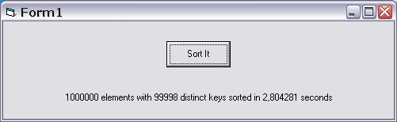

## Sort without sorting \(one million elements in 3\(\!\) seconds\) Update

### Description

This Sort-Class can be used to retrieve the elements in a one-dimensional table of strings in either ascending or descending sequence. The table itself is not altered in any way by this process, rather pointers into the table are returned which point to the elements in the table in the requested order.

Tests on a 1800 MHz Athlon processor have shown that the Sort is in fact the fastest I know, sorting 100,000 elements on a five byte random sort key in under 0.3 seconds. The speed varies only very slightly with the number of elements to be sorted, so one million elements take about three seconds to sort. Any special presorting has no measurable effect on speed (Quicksort by contrast is almost killed by a presorted sequence).
 
### More Info
 

             |
---                |---
**Submitted On**   |2004-08-13 17:26:02
**By**             |[ULLI](https://github.com/Planet-Source-Code/PSCIndex/blob/master/ByAuthor/ulli.md)
**Level**          |Advanced
**User Rating**    |4.9 (171 globes from 35 users)
**Compatibility**  |VB 6\.0
**Category**       |[Data Structures](https://github.com/Planet-Source-Code/PSCIndex/blob/master/ByCategory/data-structures__1-33.md)
**World**          |[Visual Basic](https://github.com/Planet-Source-Code/PSCIndex/blob/master/ByWorld/visual-basic.md)
**Archive File**   |[Sort\_witho1782158152004\.zip](https://github.com/Planet-Source-Code/ulli-sort-without-sorting-one-million-elements-in-3-seconds-update__1-55546/archive/master.zip)

